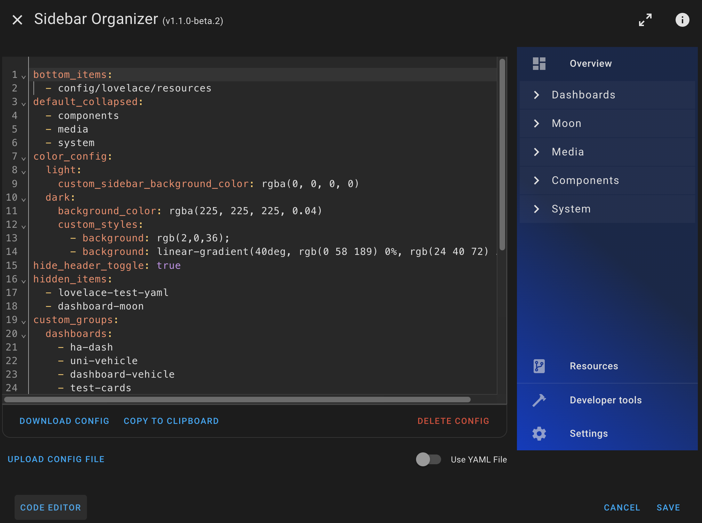

<a name="readme-top"></a>

[![hacs][hacs-validate]][hacs-url] ![Github last commit][git-last-commit-badge] ![git-download-all][git-download-all-badge] ![git-download-latest][git-download-latest-badge] [![forum][forum-badge]][forum-url]

# 🗄️ Sidebar Organizer

> ⚠️ **Important Notice**
>
> Sidebar Organizer **v2.0.0 and above** is compatible with **Home Assistant 2025.5.0 and newer**.
>
> For older Home Assistant versions, use **Sidebar Organizer up to v1.4.0**.
>
> 🔒 If you rely on Sidebar Organizer, make sure you install the version that matches your Home Assistant release.

<table>
  <thead>
    <tr>
      <th width="25%">Sidebar Default</th>
      <th width="25%">Sidebar organized</th>
      <th width="25%">Collapsed groups</th>
      <th width="25%">Expanded </th>
    </tr>
  </thead>
  <tbody>
    <tr>
      <td colspan="4">
      </td>
    </tr>
    <tr>
      <td>
       
      </td>
      <td>
       
      </td>
      <td>
       
      </td>
			<td>
       
      </td>
    </tr>
  </tbody>
</table>

## Introduction

**Sidebar Organizer** is a custom Home Assistant plugin designed to give you full control over the layout and organization of the sidebar. It allows you to customize the appearance, group items, and reorder or collapse items for a cleaner, more intuitive navigation experience.

With Sidebar Organizer, managing the sidebar in Home Assistant becomes easy and flexible. Whether you want to declutter your sidebar or create a more streamlined view, Sidebar Organizer is here to help.

## Features

- **Customize Sidebar Appearance**: Personalize the look of your sidebar with custom styles, colors, and layouts.
- **Group Menu Items**: Organize sidebar items into specific groups for better clarity and separation of content.
- **Reorder Items**: Drag and drop to reorder items within groups or across the sidebar.
- **Expand/Collapse Groups**: Expand or collapse groups of items to save space and minimize clutter.
- **Manage Bottom Items**: Move specific items to the bottom of the sidebar for quick access.
- **Default Collapse Settings**: Choose which groups of items should be collapsed by default for a cleaner view.

# Installation

## [HACS](https://hacs.xyz) (Home Assistant Community Store)

If you have not disabled the [My Home Assistant], just click on the button to go to the plugin's page, otherwise follow the next steps:

[![open-hacs-repo-badge]][hacs-repo-custom-url]

1. Go to HACS page on your Home Assistant instance
1. Add this repository via HACS Custom repositories [How to add Custom Repositories][hacs-docs]

```
https://github.com/ngocjohn/sidebar-organizer
```

3. Select type `Dashboard`

### Install the plugin

1. Search for `Sidebar Organizer`
1. Select Sidebar Organizer repo and install
1. When the plugin is already downloaded, add the url of the plugin as an extra_module_url in your configuration.yaml.

When installing through HACS your lovelace resource definition will be automatically added in Dashboard resources which you can access via the button below and and search for `sidebar-organizer`

[![Open-dashboard-resources]][dashboard-resources-link]


Example lovelace resource definition when installed through HACS.

```
/hacsfiles/sidebar-organizer/sidebar-organizer.js?hacstag=123456789
```

In configuration.yaml add this exact path to `frontend: extra_module_url:` When updating plugin through HACS make sure to update your `extra_module_url:` manually to match.
This is critically important as it prevents the resource being loaded twice.

```yaml
frontend:
  extra_module_url:
    - /hacsfiles/sidebar-organizer/sidebar-organizer.js?hacstag=123456789
```

4. Restart Home Assistant

## Manual

<details>
  <summary>Click to expand installation instructions</summary>

1. Download the [sidebar-organizer.js].
2. Place the downloaded file on your Home Assistant machine in the `config/www` folder (when there is no `www` folder in the folder where your `configuration.yaml` file is, create it and place the file there).
3. Add the url of the plugin as an extra_module_url in your configuration.yaml:

```yaml
frontend:
  extra_module_url:
    - /local/sidebar-organizer.js?v1.0.0
```

> [!TIP]
> It is recommended that you use a cache busting technique to assist with caching of old files on update (e.g. `.../sidebar-organizer.js?v2.0.0`). 4. Restart Home Assistant

</details>

# Usage

## Configuration dialog

- Access the **Sidebar Organizer** Configuration menu by press and hold the Profile menu (the last item in the sidebar).

- The settings menu is divided into three categories: Appearance, Panels, and Raw Code. Below is a breakdown of what you can customize in each section.

  

### Appearance

- **Header Title**: Change the header title.
- **Hide Header Toggle**: A button that allows you to quickly toggle between expanding or collapsing the sidebar groups.

You can set different styles for **Light** and **Dark** modes by specifying the following settings:

- **Line Color**: The color of the divider line between sidebar items.
- **Background Color**: The background color of the divider area in the sidebar.
- **Border Top Color**: The color for the top border of the sidebar divider.
- **Scrollbar Thumb Color**: Customize the color of the scrollbar's thumb for the sidebar.
- **Sidebar Background Color**: The overall background color for the sidebar.
- **Border Radius**: Customize the corner rounding for the divider. You can specify a numeric value for how rounded the corners of each panel should appear.

  All stylization is visible in the preview.

  

  <details>
    <summary>Yaml example</summary>

  ```yaml
  header_title: 'My sidebar'
  hide_header_toggle: false
  color_config:
    border_radius: 8
    light:
      divider_color: '#dddddd'
      background_color: '#ffffff'
      border_top_color: '#e0e0e0'
      scrollbar_thumb_color: '#cccccc'
      custom_sidebar_background_color: '#f5f5f5'
    dark:
      divider_color: '#444444'
      background_color: '#333333'
      border_top_color: '#555555'
      scrollbar_thumb_color: '#666666'
      custom_sidebar_background_color: '#222222'
  ```

  </details>

### Panels

In this section, you can organize the layout of the sidebar panels by customizing how items are displayed. The following options are available:

- **Bottom Items**: Select the items that will be fixed at the bottom of the sidebar, allowing you to easily access frequently used panels.

- **Custom Groups**: Organize your sidebar items into custom groups for better clarity and navigation. You can create, rename, and reorder these groups based on your preferences.

- **Default Collapsed**: Choose which groups will be collapsed by default when the sidebar loads, helping to reduce clutter and create a cleaner interface.

  <table>
    <thead>
      <tr>
        <th width="50%">Bottom Panel</th>
        <th width="50%">Group Sorting</th>
      </tr>
    </thead>
    <tbody>
      <tr>
        <td colspan="2">
        </td>
      </tr>
      <tr>
        <td>
        
        </td>
        <td>
        
        </td>
      </tr>
      <tr>
        <td colspan="2">
        Group items setting
        </td>
      </tr>
        <tr>
        <td colspan="2">
        
        </td>
      </tr>
    </tbody>
  </table>

  <details>
    <summary>Yaml example</summary>

  ```yaml
  bottom_items:
    - config/lovelace/resources
  custom_groups:
    dashboards:
      - extra-menu
      - ha-dash
      - dashboard-moon
      - test-cards
      - uni-vehicle
      - dashboard-vehicle
    lovelace_yaml:
      - lovelace-test-yaml
      - ytube-card
    components:
      - browser-mod
      - config/integrations
    media:
      - media-browser
    system:
      - calendar
      - energy
      - history
      - logbook
      - todo
  default_collapsed:
    - system
    - dashboards
    - components
  ```

  </details>

### Code

- This section lets you edit the raw YAML configuration file used by Sidebar Organizer. You can also download the current configuration as a YAML file, which should be saved in the `www` folder with the name `sidebar-organizer.yaml`.

- _This file is useful for synchronizing your sidebar settings across multiple devices. For instance, if you have a companion app and want to apply the same sidebar setup without repeating the entire process, you can enable the option to use the YAML config file in the app. This ensures the sidebar layout will be consistent with the configuration from the YAML file._

  

---

&copy; 2025 Viet Ngoc

[https://github.com/ngocjohn/](https://github.com/ngocjohn/)

<p align="right">(<a href="#readme-top">back to top</a>)</p>

<!--Badges-->

[forum-url]: https://community.home-assistant.io/t/sidebar-organizer
[forum-badge]: https://img.shields.io/badge/forum-community?style=flat&logo=homeassistant&label=community&color=blue
[hacs-validate]: https://github.com/ngocjohn/sidebar-organizer/actions/workflows/validate.yaml/badge.svg
[hacs-url]: https://github.com/ngocjohn/sidebar-organizer/actions/workflows/validate.yaml
[git-last-commit-badge]: https://img.shields.io/github/last-commit/ngocjohn/sidebar-organizer
[git-download-all-badge]: https://img.shields.io/github/downloads/ngocjohn/sidebar-organizer/total?style=flat&logo=homeassistantcommunitystore&logoSize=auto&label=Downloads&color=%2318BCF2
[git-download-latest-badge]: https://img.shields.io/github/downloads/ngocjohn/sidebar-organizer/latest/total?style=flat&logo=homeassistantcommunitystore&logoSize=auto

<!--Urls-->

[My Home Assistant]: https://www.home-assistant.io/integrations/my/
[hacs-docs]: https://hacs.xyz/docs/faq/custom_repositories/
[Open-dashboard-resources]: https://my.home-assistant.io/badges/lovelace_resources.svg
[dashboard-resources-link]: https://my.home-assistant.io/redirect/lovelace_resources/
[open-hacs-repo-badge]: https://my.home-assistant.io/badges/hacs_repository.svg
[hacs-repo-custom-url]: https://my.home-assistant.io/redirect/hacs_repository/?owner=ngocjohn&repository=sidebar-organizer&category=plugin
[sidebar-organizer.js]: https://github.com/ngocjohn/sidebar-organizer/releases/latest
